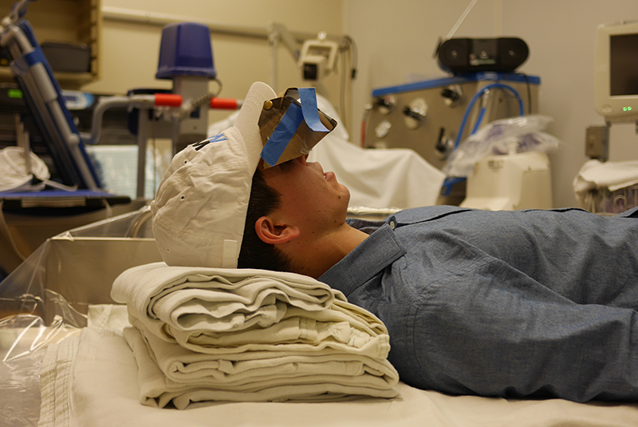
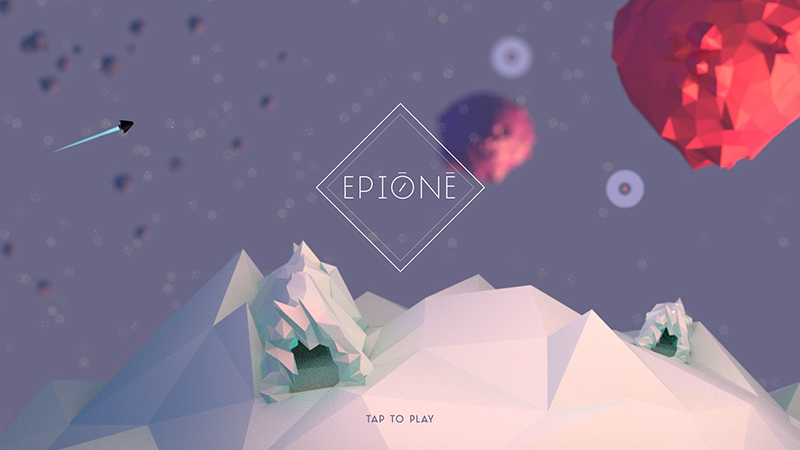
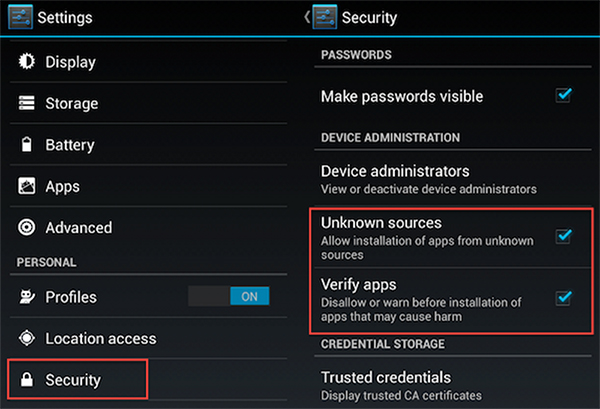
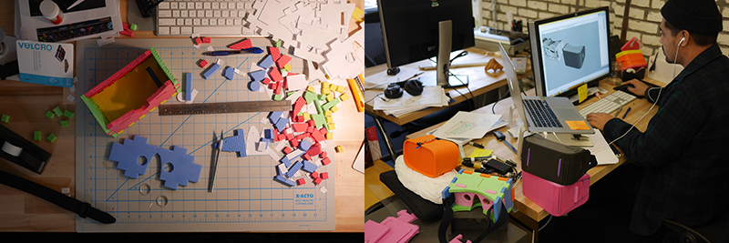

# VR Care
Starting in late 2015, an interdisciplinary internal project team located in frog design's San Francisco studio teamed up with our healthcare design fellow, Dr. Brian Pridgen, a Stanford Plastic and Reconstructive Surgery resident, to design a low-cost headset and VR game experience suitable for burn wound care. The outcome of this passion project is an inexpensive headset prototype that is extremely affordable, easy to assemble, and feasible for use in the burn wound care environment. In addition to the headset, we developed an open-source game concept, “Ēpiónē”, for use by burn patients. Our hope is that it can serve as a platform or template that other developers could use to build additional VR experiences for patients. The game will allow the patient to remain appropriately positioned for burn wound care while being immersed in a distracting virtual reality environment.

## Software

The game is downloadable as .apk file and will soon be available as an open-source Unity package and available as a free download ont he Android Plays Store. 

#### Installing the APK file
You can install APK file from the browser on your Android smartphone or tablet. Just open your device's browser and go this [link], you should then be able to see it downloading on the top bar of your device. Once it's downloaded, open Downloads, tap on the APK file (you may need to navigate to the "downloads" folder), and tap Yes when prompted. The app will begin installing on your device. 

You may need to enable a security setting in case it hasn't been enabled yet:

## Headset

An opensource version of the headset will soon be available as a template that can be obtained here, along with a list of material sources.

