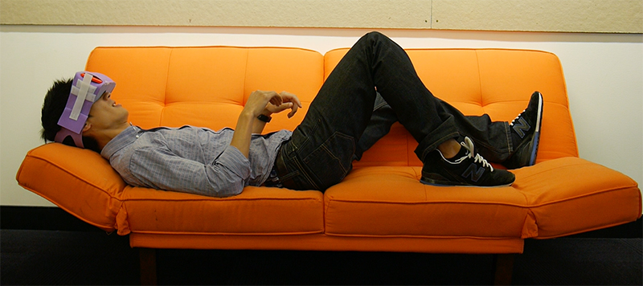
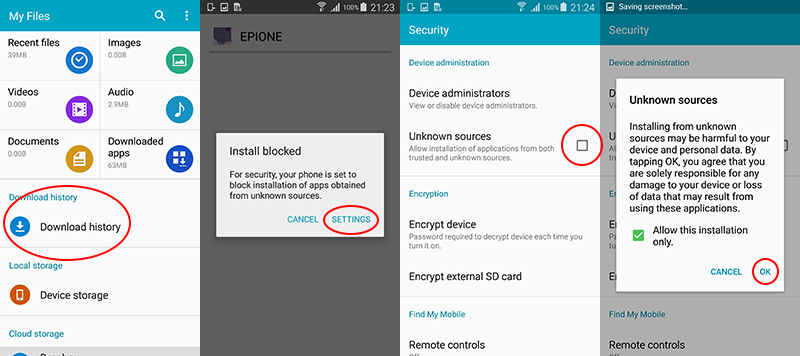

# VR Care
Starting in late 2015, an interdisciplinary internal project team located in frog's (www.frogdesign.com) San Francisco studio teamed up with our healthcare design fellow, Dr. Brian Pridgen, a Stanford Plastic and Reconstructive Surgery resident, to design a low-cost headset and VR game experience suitable for burn wound care. The outcome of this project is a headset prototype that is extremely affordable, easy to assemble, and tailored for use in the burn wound care environment. In addition to the headset, we developed an open-source game concept, “Ēpiónē”.

## Software

“Ēpiónē” is an open-source game experience for use by burn patients. Our hope is that it can serve as a platform or template that other developers could use to build additional VR experiences for patients. The game allows the patient to remain appropriately positioned in a horizontal orientation for burn wound care while being immersed in a distracting virtual reality environment. The software was initially developed in response to the shortage of mobile VR experiences that can successfully accommodate a user who is lying down, has a limited range of motion for input, and may not be able to move their appendages in order to operate physical buttons.

In addition to designing for constraints related to the immobility of the patient, we built-in two types of game mechanic to appeal to a target audience consisting of all age groups, demographics, and familiarity with games. One game-type is meditative, slower paced, and does not record a player’s score or progress. The other game type is fast-paced, more intense and records the longest distance a user is able to achieve.

The game is [downloadable as an .apk](http://frogdesign.com/sites/default/files/Epione.apk) file and will soon be available as an open-source Unity package.

#### Installing the APK file
You can install APK file from the browser on your Android smartphone or tablet. Just open your device's browser and go this link:
* US - [http://frogdesign.com/sites/default/files/Epione.apk](http://frogdesign.com/sites/default/files/Epione.apk)
* China - [http://frogdesign.cn/sites/default/files/Epione.apk](http://frogdesign.cn/sites/default/files/Epione.apk)

you should then be able to see it downloading on the top bar of your device. Once it's downloaded, open Downloads, tap on the APK file (you may need to navigate to the "downloads" folder in the "My Files" folder), and tap Yes when prompted. The app will begin installing on your device.

You may need to enable a security setting in case it hasn't been enabled yet. Click "SETTINGS", check "Unknown Sources", and "Ok":

## Contributors / Contact
* Concept / Research - Dr. Brian Pridgen
* Visual Design - Stefanie Krajnyak
* Interaction Design / Research - Andrew Haskin
* Software Development - Charles Yust (lead), Albert Dang, Ahmad Saeed
* Industrial Design - Ara Acle (lead), Jonathan Grossman, Fred Hertlein, Jonathan Kim, Jules Moretti, Rudy Servande
* Film - Nick Tucker, Mark Bowers
* Oversight / Space Yeti - Mark Freudenberg
* Marketing - Amy MacMillan

####Contact
* For partnership or development opportunities contact:
	* business [at] frogdesign [dot] com
* For media inquiries or additional information about the project contact:
	* media [at] frogdesign [dot] com

## Audio Credits
Game Music
“Friendly-Machines”, “Moonlight-Flying”, “Gentle-Closure”
by Eric Matyas
www.soundimage.org
